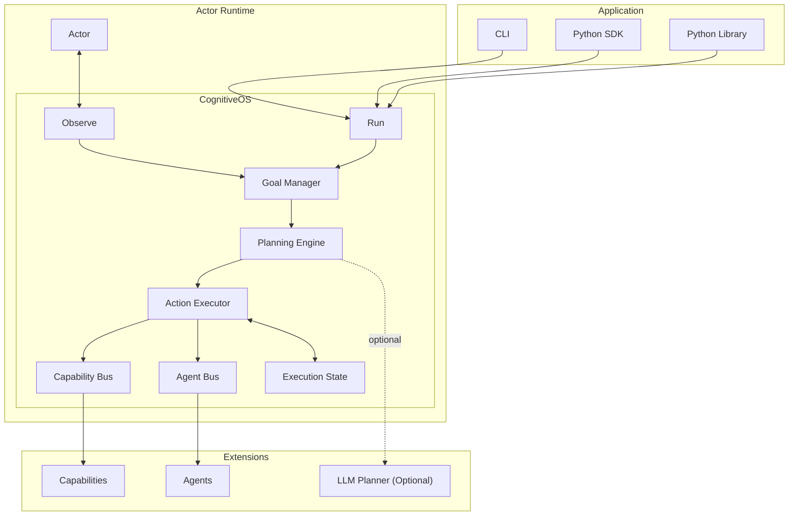

# CognitiveOS Architecture

## Overview

CognitiveOS is a **standalone cognitive runtime** for a **single autonomous actor**.

Its purpose is simple:

> **Observe → Believe → Plan → Execute**

Nothing more.

Unlike distributed agent platforms, CognitiveOS contains **no shared runtime**, **no world model**, **no learning**, **no governance**, and **no infrastructure requirements**. Every instance operates independently and owns exactly one actor.

The runtime is designed to be embedded into applications, robotics systems, simulations, CLI tools, and backend services.

---

# Design Goals

CognitiveOS is built around five principles.

## 1. Single Actor

A CognitiveOS instance owns exactly one actor.

```text
Actor
   │
   ▼
CognitiveOS
```

Multiple actors are created by instantiating multiple runtimes.

```python
alice = CognitiveOS()
bob = CognitiveOS()
warehouse = CognitiveOS()
```

No runtime state is shared between them.

---

## 2. Zero Dependencies

The runtime has no required dependencies.

```toml
dependencies = []
python >= 3.12
```

Everything beyond the standard library is optional.

---

## 3. Local Cognition

Every decision is made locally.

There is:

* no distributed execution
* no world synchronization
* no policy engine
* no authentication
* no authorization
* no persistent learning

---

## 4. Real Execution

Every planner performs actual reasoning.

Nothing returns canned responses.

Capabilities execute real code.

---

## 5. Extensible

Everything external is injected through interfaces.

Applications choose their own:

* planners
* capabilities
* agents
* databases
* LLMs
* APIs

---

# High Level Architecture



---

# Runtime Architecture

```
                Observe()
                     │
                     ▼
             Belief Formation
                     │
                     ▼
               Goal Creation
                     │
                     ▼
             Planning Engine
                     │
                     ▼
             Execution Engine
                     │
          ┌──────────┴──────────┐
          ▼                     ▼
   Capability Bus          Agent Bus
          │                     │
          ▼                     ▼
     Local Code            Local Agents
```

---

# Core Components

## Actor

The Actor represents an autonomous entity.

It owns:

* Identity
* Goals
* Beliefs
* Resources
* Capabilities

The Actor contains no execution logic.

It is simply the state of the cognitive system.

---

## CognitiveOS

CognitiveOS is the runtime.

Responsibilities:

* Observe
* Believe
* Plan
* Execute
* Interrupt
* Resume

It owns:

* Planning Engine
* Capability Bus
* Agent Bus
* Execution State

One runtime owns one actor.

---

## Observation Engine

Observations update beliefs.

Example

```
Door is open
```

becomes

```
door.state = open
```

Beliefs replace previous observations.

```
Door closed

↓

Door open

↓

door.state = open
```

---

## Goal Manager

Commands become goals.

```
Book flight

↓

Goal

↓

Priority

↓

Planning
```

Goals remain local to the actor.

---

## Planning Engine

The default planner performs deterministic planning.

It creates execution graphs using:

* observations
* capabilities
* resources
* goals

The planner has no built-in world knowledge.

Applications can optionally replace it with an LLM planner.

---

## Capability Bus

The Capability Bus dispatches work.

Capabilities are registered by applications.

```
Translate

↓

Translation Capability

↓

Execute
```

Multiple providers may implement the same capability.

Selection is based on capability matching.

---

## Agent Bus

The Agent Bus dispatches agent-type tasks.

Agents encapsulate higher-level reasoning or workflows.

The runtime itself remains unaware of implementation details.

---

## Execution State

Execution State stores intermediate results during one run.

```
Step A

↓

Result

↓

Step B

↓

Result

↓

Step C
```

State is discarded when execution completes.

---

# Cognitive Pipeline

The runtime executes the following pipeline.

```
Command

↓

Parse

↓

Goal

↓

Plan

↓

Execute

↓

Result
```

Observation follows a separate path.

```
Observation

↓

Extract Facts

↓

Beliefs Updated
```

---

# Package Layout

```
cognitiveos/

├── actor.py
├── os.py
├── protocol.py
├── interfaces.py
├── capability_bus.py
├── agent_bus.py
├── execution_state.py
├── observation.py
├── exceptions.py

├── engine/
│   ├── planner.py
│   ├── planning_engine.py
│   ├── lightweight_engine.py
│   ├── llm_planner.py
│   ├── execution.py
│   ├── action_executor.py
│   └── belief_state.py
│
├── ontology/
│
├── affiliations/
│
├── examples/
│
└── tests/
```

---

# Extension Points

Everything external is optional.

Applications may provide:

```
Custom Planner

Custom LLM

Custom Capability

Custom Agent

Custom Storage

Custom APIs
```

Nothing is required.

---

# What CognitiveOS Does

✅ Observe

✅ Believe

✅ Goal Management

✅ Planning

✅ Capability Matching

✅ Agent Dispatch

✅ Execution

✅ Interrupt / Resume

✅ Multiple Independent Actors

---

# What CognitiveOS Does NOT Do

CognitiveOS intentionally excludes platform concerns.

It does **not** provide:

* Shared World Model
* Distributed Memory
* Collective Cognition
* Learning
* Prediction
* Counterfactual Reasoning
* Compile Φ
* Commit
* Authentication
* Authorization
* Policy Engine
* Trust Networks
* Society Runtime
* Distributed Messaging
* Databases
* Message Brokers
* Telemetry Infrastructure
* Fleet Management

These capabilities belong to higher-level platforms that compose multiple CognitiveOS instances.

---

# Scaling

Scaling is achieved through composition.

```
Application

├── Actor A
│      │
│      ▼
│  CognitiveOS
│
├── Actor B
│      │
│      ▼
│  CognitiveOS
│
├── Actor C
│      │
│      ▼
│  CognitiveOS
│
└── Actor N
       │
       ▼
   CognitiveOS
```

Each runtime remains completely independent.

No state is shared.

No coordination is required.

---

# Architectural Invariants

The runtime guarantees the following:

* One CognitiveOS owns exactly one Actor.
* Every actor executes independently.
* All cognition is local.
* All execution is deterministic unless an optional engine is injected.
* No infrastructure is required.
* No global mutable state exists.
* All integrations occur through interfaces.
* Domain knowledge lives in capabilities, not in the runtime.
* Applications compose runtimes to build larger systems.

---

# Summary

CognitiveOS is a lightweight, dependency-free cognitive runtime for autonomous actors. It provides the complete local cognitive loop—**Observe → Believe → Plan → Execute**—while intentionally excluding distributed concerns such as learning, governance, world models, and persistent shared state.

By keeping the runtime focused on a single actor and exposing clear extension points for planners, capabilities, and agents, CognitiveOS remains simple to embed, easy to reason about, and suitable for applications ranging from robotics and simulations to command-line tools and backend services.
